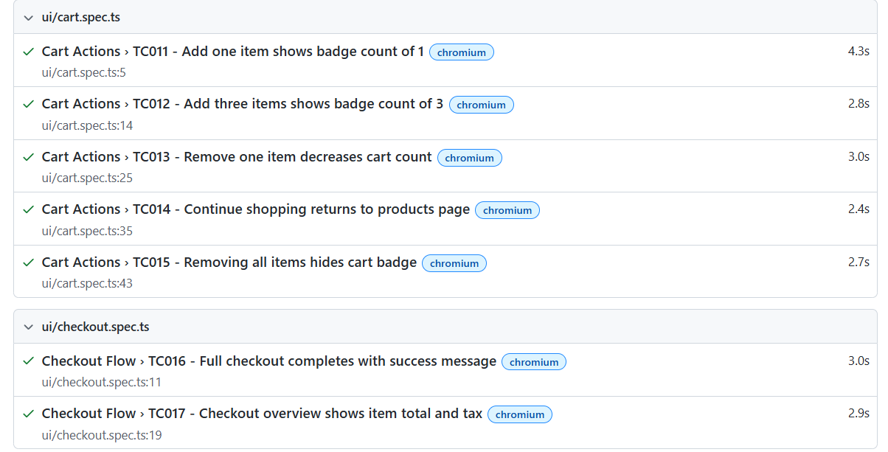

# Playwright Automation — Saucedemo.com

## Tech Stack
- Playwright Test (TypeScript)
- Page Object Model (POM)
- ReqRes.in API testing
- HTML Report with screenshots on failure

## Setup

git clone <your-repo>
cd playwright-automation
npm install
npx playwright install

## Create .env file in root

BASE_URL=https://www.saucedemo.com
API_BASE_URL=https://reqres.in/api
VALID_USERNAME=standard_user
VALID_PASSWORD=secret_sauce
LOCKED_USERNAME=locked_out_user
REQRES_API_KEY=your_key_here

Get your free API key from https://reqres.in

## Run Tests

npm test                 — Run all 36 tests
npm run test:ui          — Run only UI tests
npm run test:api         — Run only API tests
npm run test:headed      — Watch browser while running
npm run report           — Open HTML report

## Project Structure

pages/        — Page Object classes (LoginPage, ProductsPage, CartPage, CheckoutPage)
tests/ui/     — UI test specs (login, products, cart, checkout, negative)
tests/api/    — API test specs (users, auth, negative)
fixtures/     — Custom test fixtures with auto-login
utils/        — Helper functions

## Reports

After running tests open: playwright-report/index.html
Screenshots are captured automatically on any test failure.
Traces are saved on first retry for debugging.

## Test Count

Total: 36 tests
UI tests: 22
API tests: 14
Positive: 26
Negative: 10

## Test Plan

See `TEST_PLAN.md` for scope, test cases, edge cases, and risk assessment.

## HTML Report Screenshot
